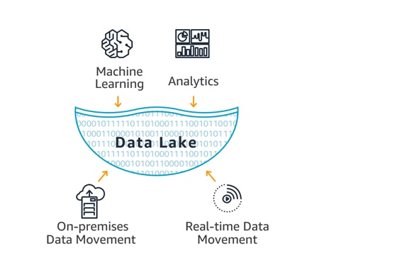

## Project Name
Implementation of Data Lake in Amazon AWS (using Star schema design) for music streaming startup **Sparkify** to perform Song Play Analysis.

## Project Description & Purpose
A startup called Sparkify wants to analyze the data they've been collecting on songs and user activity on their new music streaming app. The analytics team is particularly interested in understanding what songs users are listening to. Currently, they don't have an easy way to query their data, which resides in a directory of JSON logs on user activity on the app, as well as a directory with JSON metadata on the songs in their app.

The purpose of this project is to create a Datalake using Amazon AWS with Dimension and Fact tables designed to optimize queries on song play analysis, which will help analytics team in understanding what songs users are listening to. To achieve this, the ETL pipeline needs to be built to extract the Songs and Song play log data from AWS S3 layer and transform the data to confirm the nature of dimension and fact tables and then subsequently load the data in to another S3 bucket which will be used by the analytics team for further analysis. 


## Cloud Architecture

This project's architecture is implemented in Amazon Web Services (AWS) Cloud platform.

The various AWS components involved or required in this are as follows:
* **Amazon S3**
  * Amazon Simple Storage Service (Amazon S3) is an object storage service that offers industry-leading scalability, data availability, security, and performance.
  * Amazon S3 has a simple web services interface that you can use to store and retrieve any amount of data, at any time, from anywhere on the web. It gives any developer access to the same highly scalable, reliable, fast, inexpensive data storage infrastructure that Amazon uses to run its own global network of web sites. The service aims to maximize benefits of scale and to pass those benefits on to developers.
  * To upload the data to Amazon S3, we must first create an S3 bucket in one of the AWS Regions. We can then upload any number of objects to the bucket.
  * Amazon S3 creates buckets in a Region you specify. To optimize latency, minimize costs, or address regulatory requirements, choose any AWS Region that is geographically close to you.
  * An Amazon S3 bucket name is globally unique, and the namespace is shared by all AWS accounts. This means that after a bucket is created, the name of that bucket cannot be used by another AWS account in any AWS Region until the bucket is deleted. 
  * **In this project**: 
    * the Songs and Log datasets resides in a public S3 bucket "**udacity-dend**" whose path is as follows: <https://s3.console.aws.amazon.com/s3/buckets/udacity-dend/.
    * the output data is also written into a new S3 bucket using parquet mode.
  
  
* **IAM**
  * AWS Identity and Access Management (IAM) enables you to manage access to AWS services and resources securely. 
  * Using IAM, you can create and manage AWS users and groups, and use permissions to allow and deny their access to AWS resources. 
  * **In this project**: 
    * A new IAM user is created and the Policies to read and write S3 buckets are attached. The AWS Access ID and Secret key for this user is used to authorize the data extraction from S3 buckets.
    * *AmazonS3FullAccess* Policy is needed in order to read and write into S3 buckets
    * *AmazonElasticMapReduceforEC2Role* Policy is needed if EMR clusters are created


* **Data Lake**
  * Explained in detail in below section


* **Parquet Files**
  * Parquet is a columnar format that is supported by many other data processing systems. Spark SQL provides support for both reading and writing Parquet files that automatically preserves the schema of the original data. When writing Parquet files, all columns are automatically converted to be nullable for compatibility reasons.
  * To learn more on Parquet files, please refer <https://spark.apache.org/docs/latest/sql-data-sources-parquet.html>


## Data Lake

* **What is a data lake?**

  A data lake is a centralized repository that allows you to store all your structured and unstructured data at any scale. You can store your data as-is, without having to first structure the data, and run different types of analytics—from dashboards and visualizations to big data processing, real-time analytics, and machine learning to guide better decisions.
  
  


* **Data Lakes compared to Data Warehouses – two different approaches**

  * A data warehouse is a database optimized to analyze relational data coming from transactional systems and line of business applications. The data structure, and schema are defined in advance to optimize for fast SQL queries, where the results are typically used for operational reporting and analysis. Data is cleaned, enriched, and transformed so it can act as the “single source of truth” that users can trust.

  * A data lake is different, because it stores relational data from line of business applications, and non-relational data from mobile apps, IoT devices, and social media. The structure of the data or schema is not defined when data is captured. This means you can store all of your data without careful design or the need to know what questions you might need answers for in the future. Different types of analytics on your data like SQL queries, big data analytics, full text search, real-time analytics, and machine learning can be used to uncover insights.
  

  Characteristics | Data Warehouse | Data Lake
  --------------- | -------------- | ---------
  Data|Relational from transactional systems, operational databases, and line of business applications | Non-relational and relational from IoT devices, web sites, mobile apps, social media, and corporate applications
  Schema|Designed prior to the DW implementation (schema-on-write)|Written at the time of analysis (schema-on-read)
  Price/Performance | Fastest query results using higher cost storage | Query results getting faster using low-cost storage
  Data Quality | Highly curated data that serves as the central version of the truth | Any data that may or may not be curated (ie. raw data)
  Users | Business analysts | Data scientists, Data developers, and Business analysts (using curated data)
  Analytics | Batch reporting, BI and visualizations | Machine Learning, Predictive analytics, data discovery and profiling


## AWS config file (*Important !*)
The AWS cloud configuration such as Host/Endpoint name, DB Name, Port, Username, Password, IAM Role, S3 Bucket locations are all set in a config file named as "dl.cfg". For confidential reasons, this file is not added in Github as the file is setup in gitignore. While cloning the project, please make sure to add create the *.cfg file and assign the values for the config variables.

In this Project, the only Config parameters that are used are AWS Credentials which are stored in *.cfg file as follows. Ideally, the AWS credentials can be stored in `~/.aws/credentials` file

```
[AWS_CREDENTIALS]  
AWS_ACCESS_KEY_ID=<Access key ID of IAM user>
AWS_SECRET_ACCESS_KEY=<Secret key of IAM user>
```

## Source(s)

In this project, the data is extracted from 2 set of files which are of JSON file format located in a public S3 bucket "udacity-dend".
The S3 links for the datasets are as follows:

* Song data: 
  * *s3://udacity-dend/song_data*  (<https://s3.console.aws.amazon.com/s3/buckets/udacity-dend/log_data/)
* Log data: 
  * *s3://udacity-dend/log_data* (<https://s3.console.aws.amazon.com/s3/buckets/udacity-dend/song_data/)


#### Song Dataset
The first dataset is a subset of real data from the Million Song Dataset. Each file is in JSON format and contains metadata about a song and the artist of that song. The files are partitioned by the first three letters of each song's track ID. For example, here are filepaths to two files in this dataset.

`song_data/A/B/C/TRABCEI128F424C983.json`
`song_data/A/A/B/TRAABJL12903CDCF1A.json`

And below is an example of what a single song file, TRAABJL12903CDCF1A.json, looks like.

`{"num_songs": 1, "artist_id": "ARJIE2Y1187B994AB7", "artist_latitude": null, "artist_longitude": null, "artist_location": "", "artist_name": "Line Renaud", "song_id": "SOUPIRU12A6D4FA1E1", "title": "Der Kleine Dompfaff", "duration": 152.92036, "year": 0}`
  

#### Log Dataset
The second dataset consists of log files in JSON format which has the Song play activity logs from a music streaming app based on specified configurations.

The log files are partitioned by year and month. For example, here are filepaths to two files in this dataset.

`log_data/2018/11/2018-11-12-events.json`
`log_data/2018/11/2018-11-13-events.json`

And below is an example of what the data in a log file, 2018-11-12-events.json, looks like.


## Target(s)
The output data are loaded into a new S3 Bucket in parquet mode. The data being written is tranformed to confirm the structure of dimension and fact tables modeled based on star schema design. This includes the following tables.

#### Fact Table
1. **songplays** - records in log data associated with song plays i.e. records with page NextSong
    * songplay_id, start_time, user_id, level, song_id, artist_id, session_id, location, user_agent
    
#### Dimension Tables
2. **users** - users in the app
    * user_id, first_name, last_name, gender, level
3. **songs** - songs in music database
    * song_id, title, artist_id, year, duration
4. **artists** - artists in music database
    * artist_id, name, location, lattitude, longitude
5. **time** - timestamps of records in songplays broken down into specific units
    * start_time, hour, day, week, month, year, weekday

### Database Schema Diagram
Following is the Schema Diagram for **sparkify** database.


## ETL Process

In computing, extract, transform, load (ETL) is the general procedure of copying data from one or more sources into a destination system which represents the data differently from the source(s). 

1. Data extraction (**Extract**) involves extracting data from homogeneous or heterogeneous sources; 
2. Data transformation (**Transform**) processes data by data cleansing and transforming them into a proper storage format/structure for the purposes of querying and analysis; 
3. Finally, Data loading (**Load**) describes the insertion of data into the final target database such as an operational data store, a data mart, or a data warehouse.

#### ETL - Extract Step
Data is extracted from 2 set of files located in AWS S3 buckets which are of JSON file format. 
* songs data
* log data

Data is extracted from JSON datasets using spark.read.json command and loaded into Spark dataframes.

`df = spark.read.json(song_data)`


#### ETL - Transform Step

Data loaded in Spark dataframes are then transformed to confirm the structure and requirements of Dimension and Fact tables.

* Distinct set of Songs are extracted from Song_data dataframe.
* Distinct set of Artists are extracted from Songs dataset. There may be duplicates based on Artist name.  So the duplicates are eliminated by grouping the data by Artist ID.
* Distinct set of Users are extracted from log_data dataframe. There will be duplicate records for users from source due to the nature where a "free" user would have changed to "paid" user later. So there can be atleast 2 records for same user id with "level" value as "free" & "paid". To handle that scenario, the values are grouped based on userId, firstName, lastName and gender and a maximum value of "level" is taken.

* The timestamp for each song play (Start time) is coming from source as milliseconds format. This needs to be transformed into proper datetime format before loading into Time dimension. Also, the following time related fields are derived from the timestamp and stored into Time dimension.

  * start_time (Timestamp after converting from milliseconds to datetime format)
  * hour
  * day
  * week
  * month 
  * year
  * weekday

* Data from log_data dataframe are loaded into a new songplays dataframe by joining with other dimension tables to get the Dimension keys.User_id is used to join Users dimension and Start_time is used to join Time dimension. The events/log data does not specify an ID for either the song or the artist. So in order to relate the corresponding song ID and artist ID for each songplay, a combination of song title, artist name, and song duration time are used. 


#### ETL - Load Step
In the Load step, the extracted and transformed data is written into a new S3 Bucket using parquet mode. 
Inside the new S3 bucket, the following files are written in parquet mode.

* Songs
* Artists
* Users
* Time
* Songplays

Time dimension and Songplays Fact table are partitioned using Year and Month of Start time to facilitate efficient data retrieval.


`songs_table.write.parquet(os.path.join(output_data, 'songs'),'overwrite')`

`artists_table.write.parquet(os.path.join(output_data, 'artists'),'overwrite')`

`users_table.write.parquet(os.path.join(output_data, 'users'),'overwrite')`

`time_table.write.partitionBy("year","month").parquet(os.path.join(output_data, 'time'),'overwrite')`

`songplays_table.write.partitionBy("year", "month").parquet(os.path.join(output_data, 'songplays'), 'overwrite')`


## Project execution steps
Run the following scripts in the mentioned order.

1. `etl.py`


*Since multiple connections to the same database (in this case, sparkifydb) is not possible, please make sure to restart the kernel (or kill the exising active connection) before every new run*

## Environment and Skills
- Python, Pyspark
- Apache Spark
- AWS - S3, IAM, ec2, EMR

## References:
https://spark.apache.org/docs/latest/sql-data-sources-parquet.html
https://stackoverflow.com/questions/44011846/how-does-createorreplacetempview-work-in-spark
https://stackoverflow.com/questions/35437378/spark-save-dataframe-partitioned-by-virtual-column/35449563#35449563
https://stackoverflow.com/questions/30949202/spark-dataframe-timestamptype-how-to-get-year-month-day-values-from-field
https://stackoverflow.com/questions/52521067/spark-dataframe-repartition-and-parquet-partition
https://stackoverflow.com/questions/40416357/spark-sql-difference-between-df-repartition-and-dataframewriter-partitionby
https://stackoverflow.com/questions/52527888/spark-partition-data-writing-by-timestamp
https://stackoverflow.com/questions/42754922/column-is-not-iterable-in-pyspark
https://docs.aws.amazon.com/cli/latest/userguide/cli-configure-files.html
https://aws.amazon.com/big-data/datalakes-and-analytics/what-is-a-data-lake/
https://searchaws.techtarget.com/definition/data-lake